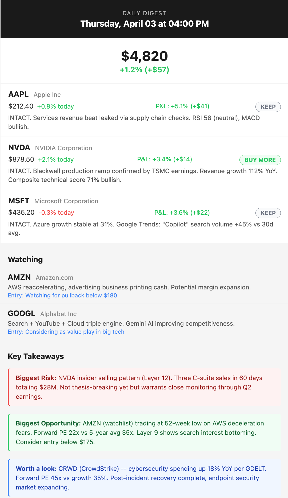
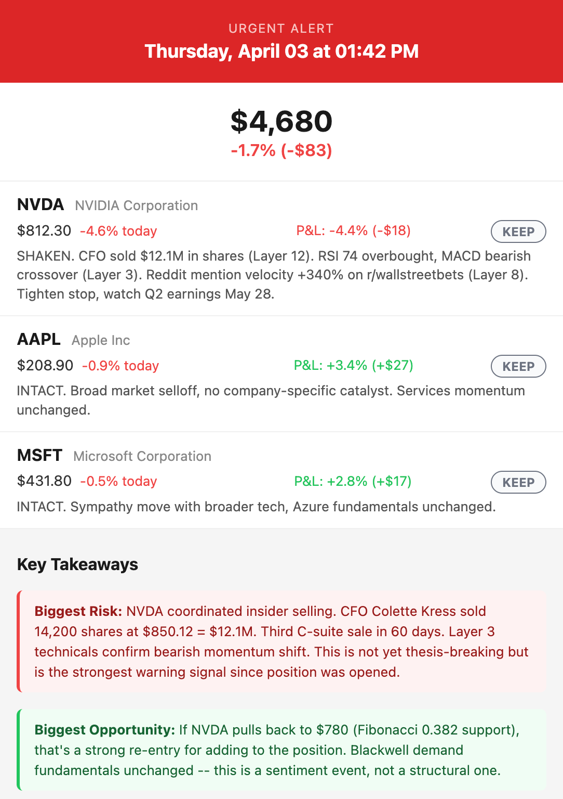

# thesis-engine

**AI-powered investment thesis monitor**

> [!CAUTION]
> **Disclaimer**: This project is **not financial advice**. It does not place trades, manage accounts, or have access to any brokerage. It is a personal research tool that gathers public data and summarizes it using AI. Your mileage may vary. The system informs -- you decide. Always do your own due diligence before making investment decisions.

---

## What it does

thesis-engine monitors your stock portfolio around the clock by pulling data from **14 independent layers**, synthesizing it through an LLM, and alerting you when something threatens (or strengthens) your investment thesis.

The 14 data layers:

1. **Prices** -- Real-time quotes, cost basis tracking, gain/loss calculations
2. **Fundamentals** -- P/E, revenue growth, margins, debt ratios via Finnhub
3. **Technicals** -- 17 technical indicators (RSI, MACD, Bollinger, ADX, Ichimoku, Stochastic, OBV, VWAP, Keltner, Fibonacci, and more) with composite scoring
4. **Macro** -- Fed funds rate, inflation (CPI), GDP, unemployment, VIX, treasury yields
5. **Press releases** -- SEC 8-K filings classified by type (dilution, contract, executive, earnings)
6. **News RSS** -- Multi-source news aggregation with sentiment scoring
7. **Reddit** -- Retail sentiment from r/stocks, r/wallstreetbets, and ticker-specific subreddits
8. **Wikipedia** -- Recent edits to company pages (controversy/vandalism detection)
9. **World news** -- GDELT-powered geopolitical event monitoring
10. **Google Trends** -- Search interest trends for company names and tickers
11. **Insider trades** -- SEC Form 4 filings with C-suite detection
12. **Hedge funds** -- 13F institutional ownership changes
13. **Congress trades** -- STOCK Act disclosures with sector-aware committee relevance
14. **Sustainability** -- ESG signal extraction (environmental, social, governance red flags)

---

## What the emails look like

### Daily digest

Portfolio summary with action badges (BUY MORE / KEEP / SELL), P&L, watchlist, and key takeaways:



### Urgent alert

Red header, fired immediately when thesis-breaking events are detected:



---

## Architecture

```
stocks.yaml (your portfolio config)
        |
        v
  14 parallel data layers (free APIs, no keys needed for most)
        |
        v
  LLM synthesis (one API call per analysis run)
        |
        v
  Email alerts (urgent / daily digest / weekend prep)
```

**Data flow**: On each run, the analyzer reads your `stocks.yaml`, dispatches all 14 data-fetching modules in parallel using `ThreadPoolExecutor`, collects the results into a single context bundle, and sends it to the LLM with a carefully tuned prompt. thesis-engine decides whether an urgent alert is needed or if a standard digest suffices.

---

## Cost

Everything except the LLM API is free. Your total cost depends on which model you choose:

| Claude Model | Speed | Quality | Best for |
|---|---|---|---|
| Haiku | Fastest | Good | Routine monitoring, testing |
| Sonnet | Fast | Great | Daily use (recommended) |
| Opus | Slower | Best | Deep thesis evaluation |

At ~200 runs/month (hourly during market hours), expect to pay **pennies to a few dollars/month** depending on model. Check [Anthropic's pricing page](https://www.anthropic.com/pricing) for current rates.

All other components are free:

| Component | Cost |
|---|---|
| Finnhub API | Free tier (60 calls/min) |
| Reddit API | Free (personal/non-commercial use only, requires OAuth credentials) |
| Quiver Quant (Congress) | Free tier |
| GitHub Actions | Free (2,000 min/month) |
| SEC EDGAR, BLS, GDELT, Wikimedia | Free (public APIs) |
| Gmail SMTP | Free |

Switch models by changing one line in `analyzer.py`. Start with Haiku to test, move up from there.

---

## Setup

### 1. Clone the repo

```bash
git clone https://github.com/YOURUSERNAME/thesis-engine.git
cd thesis-engine
```

### 2. Run setup

```bash
chmod +x setup.sh
./setup.sh
```

This creates a virtual environment, installs dependencies, and scaffolds config files.

### 3. Configure environment

Edit `.env` with your API keys:

```bash
ANTHROPIC_API_KEY=your-api-key-here
FINNHUB_API_KEY=your-finnhub-key-here
NOTIFY_EMAIL=your@email.com
EMAIL_PASSWORD=your-gmail-app-password
```

For Gmail, you need an [App Password](https://myaccount.google.com/apppasswords) (not your real password). Enable 2-Step Verification first.

### 4. Configure your portfolio

Edit `stocks.yaml` with your holdings. See `stocks.yaml.example` for format.

### 5. Test locally

```bash
source .venv/bin/activate
python analyzer.py --test
```

### 6. Deploy

Set up GitHub Actions in your private fork (see `analyze.yml.example`) or run via cron on any server.

---

## File structure

```
thesis-engine/
├── analyzer.py              # Main orchestrator
├── modules/
│   ├── prices.py            # Layer 1: Price & cost basis
│   ├── fundamentals.py      # Layer 2: Financial ratios
│   ├── technicals.py        # Layer 3: Technical indicators
│   ├── macro.py             # Layer 4: Macroeconomic data
│   ├── press_releases.py    # Layer 5: SEC 8-K filings
│   ├── news_rss.py          # Layer 6: News sentiment
│   ├── reddit.py            # Layer 7: Retail sentiment
│   ├── wikipedia.py         # Layer 8: Wiki edit monitoring
│   ├── world_news.py        # Layer 9: Geopolitical events
│   ├── google_trends.py     # Layer 10: Search trends
│   ├── insider_trades.py    # Layer 11: Insider transactions
│   ├── hedge_funds.py       # Layer 12: Institutional ownership
│   ├── congress_trades.py   # Layer 13: Congressional trades
│   ├── sustainability.py    # Layer 14: ESG signals
│   └── alerts.py            # Email formatting & delivery
├── tests/                   # Unit tests (pure functions, no API keys)
├── stocks.yaml.example      # Sample portfolio config
├── .env.example             # Environment variable template
├── .github/workflows/
│   └── ci.yml               # Lint + test on push/PR
├── setup.sh                 # One-command setup
├── requirements.txt         # Python dependencies
├── pyproject.toml           # Ruff/project config
└── LICENSE                  # MIT
```

---

## Alert types

### Urgent alerts
Sent immediately when thesis-engine detects a thesis-breaking event:
- Major insider selling by C-suite
- SEC investigation or fraud allegations
- Dilutive offering announced
- Earnings miss with guidance cut
- Congress member on relevant committee selling

### Daily digest
End-of-day summary across all holdings. Includes action badges (BUY MORE / KEEP / SELL) for each position.

### Weekend prep
Sunday evening review. Covers macro trends, sector rotation, and thesis health heading into Monday.

---

## Managing your portfolio

All portfolio configuration lives in `stocks.yaml`. This is the only file you need to edit.

- **Add a stock**: Copy an existing entry, update ticker/sector/thesis
- **Remove a stock**: Delete the entry
- **Track a purchase**: Add a new entry under `purchases` with date, dollars, and price_per_share
- **Add to watchlist**: Add tickers under the `watchlist` section (lighter monitoring, no cost basis)
- **Update thesis**: Modify the `thesis` and `thesis_risks` fields as your conviction evolves

---

## Troubleshooting

| Issue | Fix |
|---|---|
| `ANTHROPIC_API_KEY not set` | Add your key to `.env` |
| `Finnhub rate limit` | Free tier allows 60 calls/min -- reduce portfolio size or add delays |
| `Reddit 403` | Create a Reddit app at reddit.com/prefs/apps and add credentials to `.env` |
| `Email not sending` | Ensure you're using a Gmail App Password with 2FA enabled |
| `No data for ticker` | Some layers skip OTC/foreign stocks -- this is expected |
| `LLM response empty` | Check your Anthropic API key and billing status |
| Tests failing | Run `source .venv/bin/activate && pytest -v` to see details |

---

## Using with a private repo

This project is designed to run in a **private** GitHub repo (your portfolio data is personal).

1. **Fork or clone** this repo
2. **Make it private**: Settings > Danger Zone > Change visibility > Private
3. **Add secrets** in your private repo: Settings > Secrets and variables > Actions
   - `ANTHROPIC_API_KEY`
   - `FINNHUB_API_KEY`
   - `NOTIFY_EMAIL`
   - `EMAIL_PASSWORD`
   - `REDDIT_CLIENT_ID` (optional)
   - `REDDIT_CLIENT_SECRET` (optional)
   - `QUIVER_API_KEY` (optional)
4. **Rename** `.github/workflows/analyze.yml.example` to `analyze.yml`
5. **Edit** `stocks.yaml` with your actual holdings
6. **Push** -- GitHub Actions will start running on schedule

```bash
git clone https://github.com/YOURUSERNAME/thesis-engine.git
cd thesis-engine
# Make it private on GitHub first, then:
cp stocks.yaml.example stocks.yaml
cp .github/workflows/analyze.yml.example .github/workflows/analyze.yml
# Edit stocks.yaml and .env with your real data
git add -A && git commit -m "Configure my portfolio"
git push
```

---

## License

MIT -- see [LICENSE](LICENSE).
